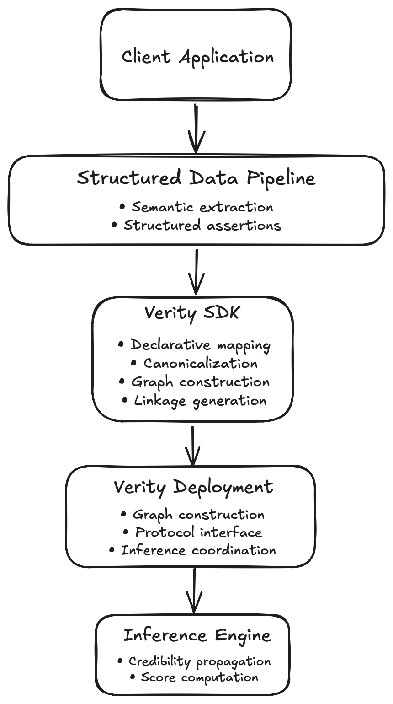

# Verity Architecture

This document provides a high-level overview of the Verity architecture and defines its fundamental components and their interactions.

To see related specifications, visit:

- **[`protocol.md`](../protocol/protocol.md)** — the communication contract between clients and Verity deployments. Defines the JSON-RPC protocol and request & response formats.
- **[`canonicalization.md`](../protocol/canonicalization.md)** — deterministic normalization rules. Specifies how semantically equivalent assertions produce the same graph representation before inference.
- **[`sdk.md`](../protocol/sdk.md)** — client integration guides for constructing graphs, linkage token generation, submitting requests from supported languages.
- **[`mcp.md`](../protocol/mcp.md)** — the MCP binding for the Verity Protocol.

## 1. Objectives

The system architecture is designed to compute structural credibility over structured assertions collected from various independent sources.

A major goal for Verity is to enable integration with existing structured data pipelines, regardless of application domain, programming language, or deployment environment used.

The architecture is guided by several core design principles:

- Semantic extraction is separated from credibility inference.
- Deterministic graph construction through standardized canonicalization.
- Privacy-preserving linkage using tokens instead of the underlying content of the data.
- Producing deterministic credibility signals from graph topology.
- Deployment through standard protocol interfaces such as MCP.
  
## 2. System Overview

At the highest level, Verity is composed of three key architectural components:

- Verity SDK
- Verity Deployment
- Inference Engine

Applications can install and integrate the Verity SDK directly into their structured data pipelines. The SDK performs deterministic canonicalization, generates privacy-preserving linkage tokens, constructs a graph update, and submits it to a Verity deployment.

A Verity deployment receives graph updates from the Verity SDK, constructs the submitted credibility graph, executes structural credibility inference, and returns credibility signals to the application.

  

  <em>Figure 1. High-level architecture of the Verity system.</em>

## 3. Architectural Components

### 3.1 Verity SDK

The SDK serves as the primary integration point between applications and a Verity deployment.

### 3.2 Verity Deployment

A deployment is the runtime environment responsible for receiving graph updates, constructing the inference graph, executing the inference engine, and returning credibility signals.

### 3.3 Inference Engine

The inference engine in Verity implements an iterative graph-based propagation ranking method. It computes structural credibility scores by propagating credibility throughout the graph.

## 4. End-to-End Workflow

This section specifies how data flows through a Verity deployment, from the point an application creates structured assertions to receiving credibility signals.

### 4.1 Structured Data Pipeline

A core principle of Verity is it does not analyze raw data. Applications collect and organize information from their own data sources. Some examples of data sources could include REST APIs, databases such as SQL, documents, spreadsheets, knowledge bases, MCP tools, or even the outputs of AI agents. The application should interpret the data and convert it to structured assertions before interacting with Verity.

The method used to perform semantic extraction is outside the scope of Verity.

### 4.2 Canonicalization

The Verity SDK applies deterministic canonicalization to structured assertions before constructing graph updates. The canonicalization rules are defined in the Verity Canonicalization Specification.

### 4.3 Linkage Token Generation

The SDK generates privacy-preserving linkage tokens from the canonicalized graph update. The method used to generate linkage tokens is defined separately from the system architecture.

### 4.4 Graph Update Construction

The SDK constructs a graph update message containing the linkage tokens and associated protocol metadata before submitting it to a Verity deployment.

### 4.5 Graph Submission

The graph update is transmitted to a Verity deployment using a supported protocol binding (such as MCP).

### 4.6 Credibility Inference

After submission, the deployment resolves the linkage tokens, constructs the credibility graph represented by the submitted assertions, and executes the configured inference algorithm to compute structural credibility.

### 4.7 Credibility Response

The deployment returns deterministic credibility signals to the application.

## 5. Inference Graph

Each inference request defines a credibility graph composed of the submitted sources, claims, and assertions. The deployment constructs this graph before executing structural credibility inference.

### 5.1 Graph Structure

The credibility graph is modeled as a bipartite graph where source and claim nodes connect through their assertions (edges). The submitted assertions determine the topology analyzed during inference.

### 5.2 Graph Construction

After resolving linkage tokens, the deployment constructs the credibility graph represented by the submitted assertions. This graph serves as the input to the inference engine for the duration of the inference request.

## 6. Deployment

### 6.1 Reference Implementation

The reference implementation is designed to be deployed as a self-hosted MCP server. It accepts graph updates, executes structural credibility inference, and returns deterministic credibility signals according to the Verity Protocol.

### 6.2 Trust Boundary

Applications perform semantic extraction and canonicalization before interacting with Verity. Verity operates only on protocol-compliant graph updates and does not interpret the underlying content. This separation establishes the trust boundary between application-specific processing and structural credibility inference.
